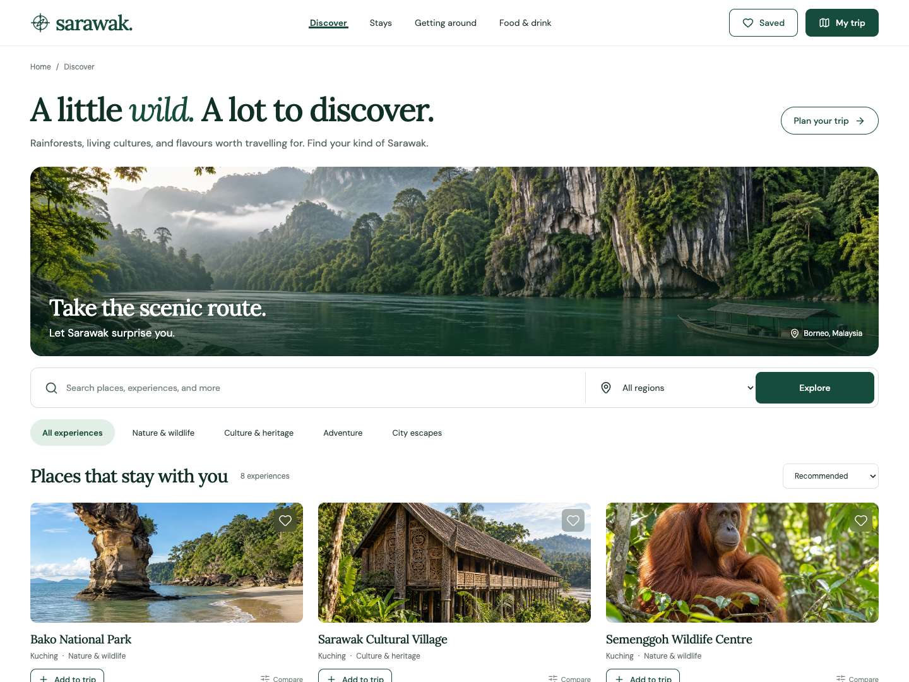
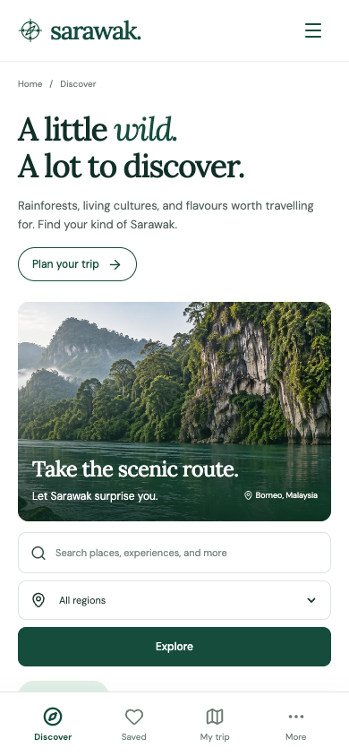

# sarawak.

A responsive Sarawak tourism UI/UX prototype based on the SWE30003 Assignment 01 case and the supplied draft SRS. It supports discovery, planning, external travel arrangements, and a local management demonstration.

**Live prototype:** [sarawak-tourism-prototype.vercel.app](https://sarawak-tourism-prototype.vercel.app/) · **Source:** [GitHub](https://github.com/Yoriichi-0u0/sarawak-tourism-prototype)

The production site is public and requires no login. Vercel is connected to the GitHub `main` branch for future deployments. Anyone with the site link can explore the prototype; local management changes remain on their own device.

## Desktop and mobile previews

Captured from the public deployment at 1440×1080 and 390×844. Images are illustrative concept photography.





## Explore the prototype

- **Discover:** search eight attractions, filter by region and interest, compare up to three places, and open visitor information.
- **Stays:** browse illustrative accommodation types and hand off to an external provider for actual properties and bookings.
- **Getting around:** enter an origin and destination, explore operator information, and recover from an unsupported route.
- **Food & drink:** discover local dishes and dining ideas with dietary reminders and official information links.
- **Saved:** keep favourite places on the current device.
- **My trip:** name a trip, set its date and length, add notes, move and reorder places between days, export a text itinerary, and share a link that another visitor can explicitly import.
- **Management demo:** create and edit listings, archive and restore them, inspect local activity, and export CSV. The session ends after 15 minutes of inactivity.

On mobile, use the bottom navigation and **More** to reach Stays, Getting around, Food & drink, and Management demo. The management link also appears in the footer.

## Run locally

Requires Node.js 22.12 or newer (Node.js 24 LTS recommended).

```sh
npm ci
npm run dev
```

Open the URL printed by Vite, normally `http://localhost:5173`.

```sh
npm test
npm run build
npm run preview
```

The lockfile records the exact dependencies. The app uses React, TypeScript, Vite, Lucide icons, and self-hosted DM Sans and Lora fonts. Images are original generated concept illustrations, optimized as WebP.

## Prototype boundaries

This is a UI/UX demonstrator, not the final production tourism system. No accounts, passwords, payments, real reservations, live availability, verified operating hours, or shared tourism database are implemented. The management area is deliberately accessible as a local demo; it does not claim to meet the SRS's production staff authorization requirement. Edits, saved places, and activity counts are isolated to browser local storage. Clearing browser data clears them.

Supabase is unnecessary for this scope and was not provisioned. A real shared management portal would need server-side authorization, authenticated staff sessions, authoritative data, and database access policies.

Shared trip URLs include the title, dates, and notes visible in the trip. Only the original catalogue entries are shareable; local management-demo entries are excluded. Importing a trip replaces the current local itinerary after the visitor clicks **Import trip**.

The SRS draft has incomplete task and quality sections. Food discovery, favourite lists, itinerary editing, and local reports are explicitly documented design assumptions derived from the goals and scope. The original assignment files were not edited or uploaded. No student names/IDs or source textbook content appear in this repository.

## Project notes

- [Folder review and source inventory](docs/project-review.md)
- [Requirement and workflow mapping](docs/requirements.md)
- [Design system and visual comparison](docs/design.md)
- [Verification evidence](docs/verification.md)
- [Image generation prompts](docs/image-prompts.md)

Official visitor reference links include the [Sarawak Tourism Board](https://www.sarawaktourism.com/), [Sarawak Forestry](https://sarawakforestry.com/), [Sarawak Cultural Village](https://scv.com.my/), [Mulu National Park](https://mulupark.com/), and [Sarawak Museum](https://museum.sarawak.gov.my/). Provider links require HTTPS and open in a separate tab. The prototype does not guarantee availability or destination coverage on those external services.
